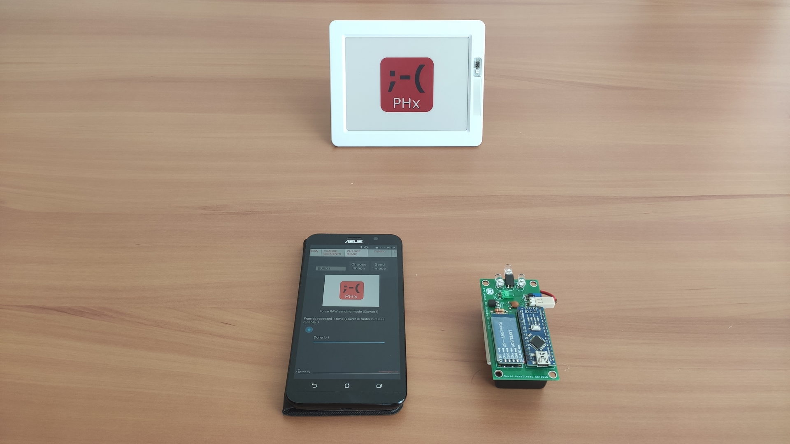

# Pricehax BT
Working prototype of the ESL hack project of furrtek using Pricehax BT app, Arduino Nano board and HC-06 (or HC-05) module for bluetooth communication.

## Build
- Create the dongle on breadboard following the schematic (or order the pcb and solder the components)
- Using AT commands, change the name of the HC-05/HC-06 module to "PRICEHAX TX V3" and its baud rate to 57600bps (115200bps and more will not work because of the SoftwareSerial library usage that produces errors at those rates)
- Program the arduino nano with the included sketch
- Install the android app, pair the dongle and enjoy :-)

## Android app improvements
- Fixed some bugs and crashes
- Added the ability to scroll if pages are greater than the height of the screen (especially in landscape mode)
- Display debug infos all the time
- Hide debug infos feature added
- Ability to blink the green LED on ST ESLs (not working yet on some)
- Start autofocus by touching the preview screen on "PLID Scan" tab
- ESL types added (mainly graphic ESLs, not tested on the most of them but it should work)
- Automatically choose sending compressed or raw data to graphic ESLs
- Ability to force not compressed data sending to graphic ESLs
- The number of repeats of frames for graphic ESLs can be chosen (speed transmission vs reliability)
- The dongle can be manually connected or disconnected in "Config" page

## Notes
- Android app sources are included
- I didn't write the app, I only decompiled sources of the apk, imported them on Android Studio and rebuilt the app
- The app supports only Bluetooth communication
- Furrtek had already code Bluetooth feature in the original app, I just made some changes for that feature works with my dongle
- I am not a programming or electronic expert, so maybe I made some mistakes on coding or making the schematic...

#

Both furrtek and me decline all responsability for any kind of issues related by an illegal use of this project.

Copyright (c) furrtek 2014 - david4599 2019